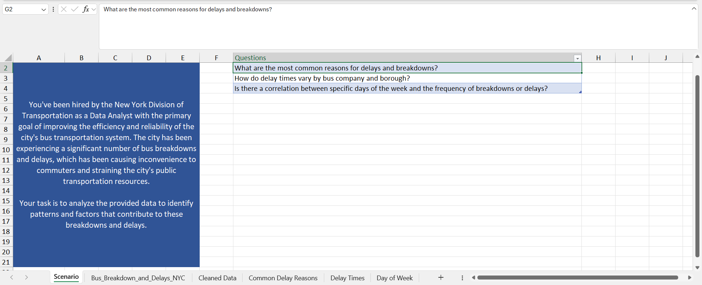

There are 282191 rows and 21 columns in this dataset. 

-------------

The same data cleaning procedures apply for Excel too.

4 steps:
1) Removing duplicates
2) Standardizing Data
3) Handling NULL Values
4) Deleting Unnecessary Rows/Columns if possible

-----------

I followed these guidelines as well as the reference video.

---------

### Scenario and the three requests:

----------

### Raw Data:

----------

- To get the day of the week from the date, use the function WEEKDAY(H2; 1) --> Sunday:1... Saturday:7
- Then, change the numbers 2,3,4,5,6 to Monday, Tuesday, Wednesday, Thursday, Friday.
- One can change the number format in the WEEKDAY function.
- For example, WEEKDAY(H2; 2) gives 1 (Monday) through 7 (Sunday).

----------

Now, standardize the bus company name:

1) Insert a new blank column beside the original column.
2) Use filters to find the most general bus company name for each of them --> manually done.
3) Utilize copy-paste and CTRL+Shift+Down Arrow to quicken the process.

----------

Use text to row button to separate delay times.
- Later, the average of the low end and high end numbers are used inside pivot tables and charts.

-----------

### The first request is handled - Part 1 - Common Delay Reasons

-----------

Part 2 - Common Delay Reasons

------------

### The second request is managed - Part 1 - Delay Times

-----------

Part 2 - Delay Times

-----------

Part 3 - Delay Times

-----------

### The last request is taken care of - Part 1 - Day of Week

-----------

Part 2 - Day of Week

-----------

### Thank you!
